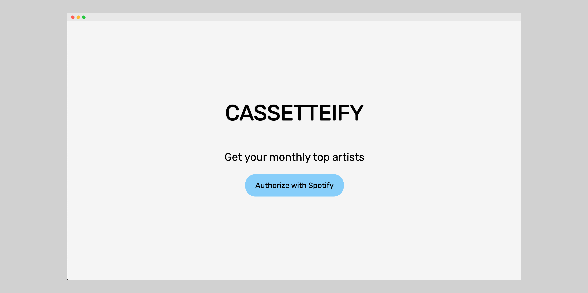

# Cassetteify

Inspired by the popular [Receiptify](https://receiptify.herokuapp.com/), Cassetteify
allows you to view your current month's most top ten artists in a little cassette
illustration (each made out of a single div!).

Runs on Flask and uses [Spotipy](https://github.com/plamere/spotipy) to interact with
Spotify's API.



## Running locally

To run, create a `.env` file with the following information from your Spotify developer
dashboard:

```
CLIENT_ID=<id>
CLIENT_SECRET=<secret>
```

Make sure your environment has the latest versions of `flask`, `spotipy`, `dotenv`, and
`os` downloaded, then run `python app.py` in the terminal.